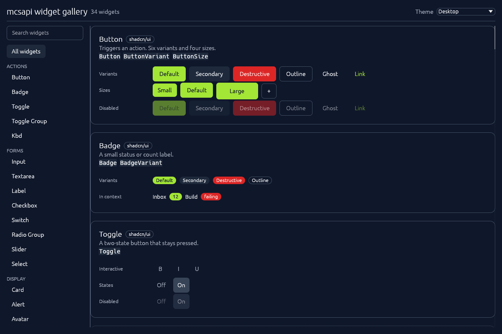
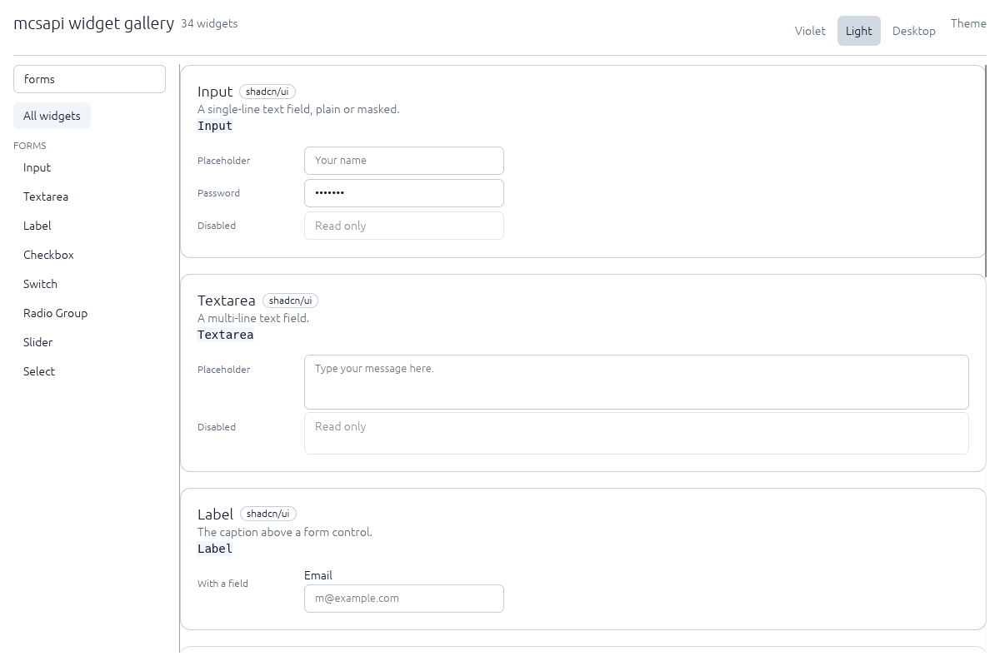

# mcsapi-gallery

A live gallery of every widget mcsapi apps can use: the shell widgets in
`mcsapi::widgets` and every component in `mcsapi-components`, each drawn in its
variants and states (sizes, disabled, checked, open, ...). Every control is
interactive, and the theme select in the header redraws everything under the
desktop theme, a light theme, or a violet one.

```console
$ cargo run -p mcsapi-gallery --features preview
$ cargo run -p mcsapi-gallery --features preview -- --theme light --search forms
$ cargo run -p mcsapi-gallery --features preview -- "Alert Dialog"
```

The window is behind the `preview` feature so CI and library users do not
build windowing crates. `Gallery` itself is an ordinary `mcsapi_ui::App`, so a
compositor host can run it like any other app.




## Adding a component

1. Write a `fn(&mut Ui, &mut State)` in the matching module under
   `src/specimens/` that draws the component in each variant and state, using
   `row` for labeled rows and `disabled_row` for the disabled state. Keep any
   state the demo mutates in that module's `State`.
2. Add a `Specimen` to the module's `SPECIMENS` slice, listing the public items
   it shows in `api`.

`cargo test -p mcsapi-gallery` fails while `mcsapi-components` exports an item
that no specimen lists, and it renders every specimen under every theme.
