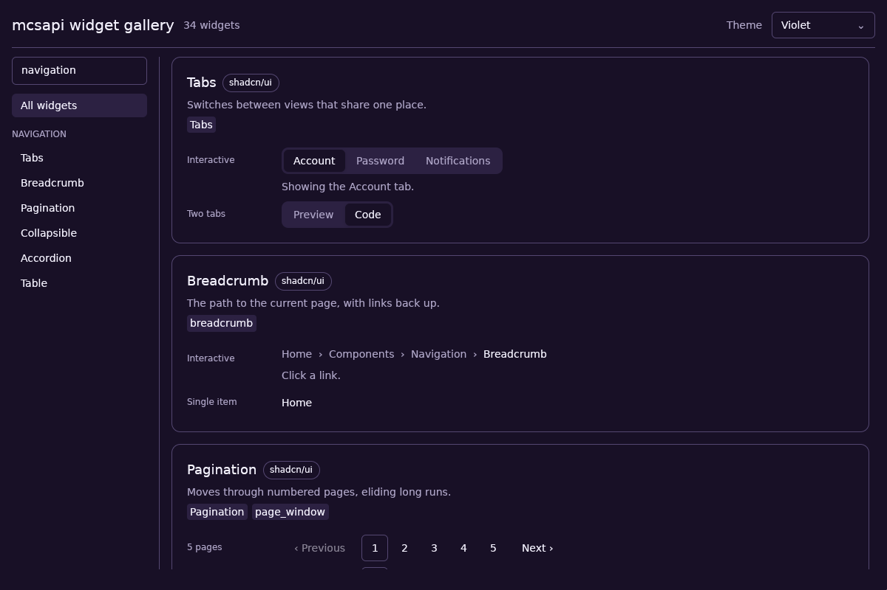
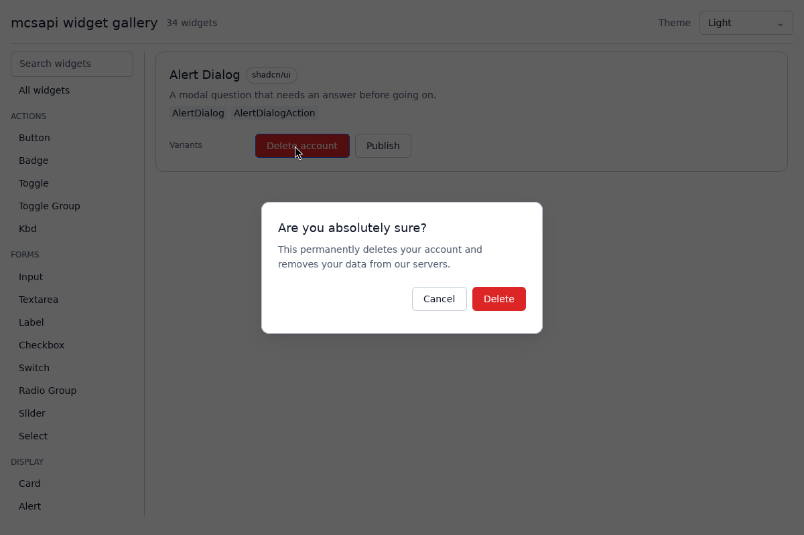

# mcsapi-gallery

A live gallery of every widget mcsapi apps can use: the shell widgets in
`mcsapi::widgets` and every component in `mcsapi-components`, each drawn in its
variants and states (sizes, disabled, checked, open, ...). The window is drawn
with GPUI through `mcsapi-components-gpui`. Every control is interactive, and
the theme select in the header redraws everything under the desktop theme, a
light theme, or a violet one.

```console
$ cargo run -p mcsapi-gallery --features gpui
$ cargo run -p mcsapi-gallery --features gpui -- --theme light --search forms
$ cargo run -p mcsapi-gallery --features gpui -- "Alert Dialog"
```

The window is behind the `gpui` feature so CI and library users do not build
windowing crates; it needs the same system libraries as `mcsapi`'s `gpui`
feature and a Wayland session. Without the feature the crate still builds the
egui `Gallery`, an ordinary `mcsapi_ui::App` that draws the egui versions of
the same specimens, which the tests render headlessly.





## Adding a component

1. Write a `fn(&mut Ui, &mut State)` in the matching module under
   `src/specimens/` that draws the egui component in each variant and state,
   using `row` for labeled rows and `disabled_row` for the disabled state. Keep
   any state the demo mutates in that module's `State`.
2. Add a `Specimen` to the module's `SPECIMENS` slice, listing the public items
   it shows in `api`.
3. Add a renderer for the GPUI version to `RENDERERS` in `src/gpui_gallery.rs`,
   keyed by the specimen's name, using `row` and `rows` the same way.

`cargo test -p mcsapi-gallery` fails while `mcsapi-components` exports an item
that no specimen lists, and it renders every specimen under every theme. With
`--features gpui` it also fails while a specimen has no GPUI renderer or
`mcsapi-components-gpui` exports an item that no specimen lists.
